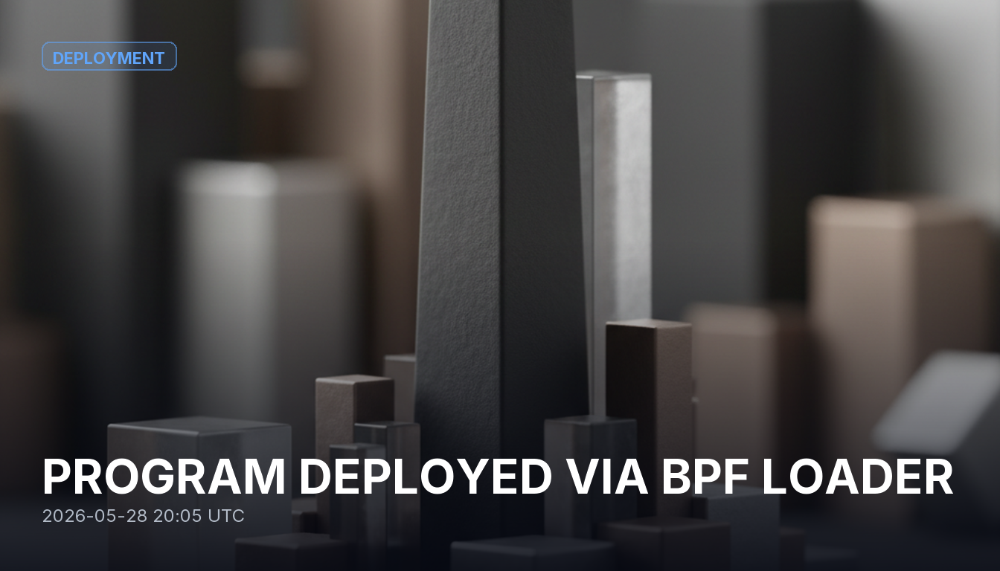

# PROGRAM DEPLOYED VIA BPF LOADER

A new program was deployed through the BPF upgradeable loader. The program has no public identity yet — no name, site, or documentation — so the transaction itself is the only record available to reason from. Because it uses the upgradeable loader, the program's code can be changed later by whoever holds its upgrade authority — so that authority's identity and intentions are what determine how trustworthy the deployment is over time.

## Sources
- https://solscan.io/tx/2YxfWHLxbs4hya1kYaQSDRJdu528YfUFxgr3L7hiJWax7Drx2FMU1KpAi4c6ajjoufGtHXwHUALuYE3k2UmdsBfy

## Provenance
Solana tx `2YxfWHLxbs4hya1kYaQSDRJdu528YfUFxgr3L7hiJWax7Drx2FMU1KpAi4c6ajjoufGtHXwHUALuYE3k2UmdsBfy` — https://solscan.io/tx/2YxfWHLxbs4hya1kYaQSDRJdu528YfUFxgr3L7hiJWax7Drx2FMU1KpAi4c6ajjoufGtHXwHUALuYE3k2UmdsBfy
Category: Deployment
