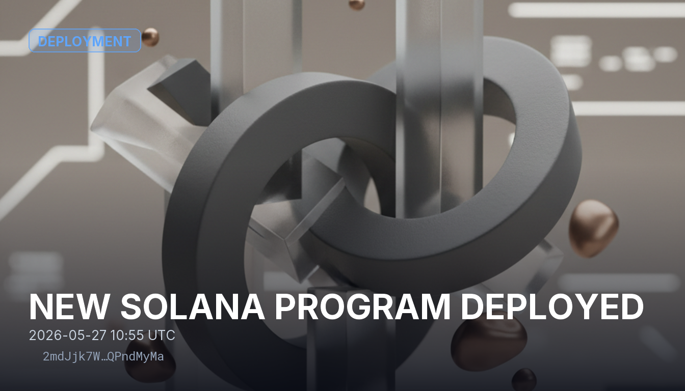

# NEW SOLANA PROGRAM DEPLOYED

A new Solana program was deployed through the BPF upgradeable loader in transaction `2mdJjk7WbnYpcDE2vj3GPTNdDY3SmBLs9o7s6mooDdT1cHsBUSqCQB3WBs4fWijragYqjruRzdYRLV5gQPndMyMa`. The program has no public identity yet — no name, site, or documentation — so the transaction itself is the only record available to reason from. A program on this loader can be modified while its upgrade authority remains active, so whether that authority is retained or revoked is the key question for its long-term immutability.

## Sources
- https://solscan.io/tx/2mdJjk7WbnYpcDE2vj3GPTNdDY3SmBLs9o7s6mooDdT1cHsBUSqCQB3WBs4fWijragYqjruRzdYRLV5gQPndMyMa

## Provenance
Solana tx `2mdJjk7WbnYpcDE2vj3GPTNdDY3SmBLs9o7s6mooDdT1cHsBUSqCQB3WBs4fWijragYqjruRzdYRLV5gQPndMyMa` — https://solscan.io/tx/2mdJjk7WbnYpcDE2vj3GPTNdDY3SmBLs9o7s6mooDdT1cHsBUSqCQB3WBs4fWijragYqjruRzdYRLV5gQPndMyMa
Category: Deployment
