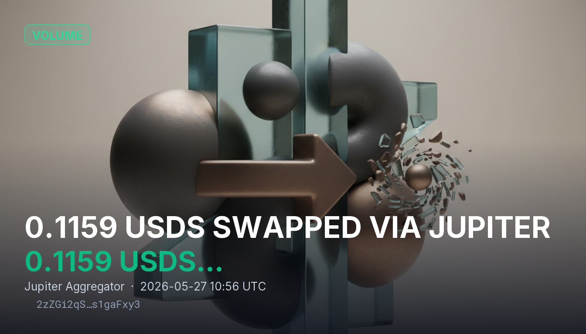

# 0.1159 USDS SWAPPED VIA JUPITER

0.1159 USDS was swapped from tqCiSbcbr1QKCv7fNA3gaEgCzTgy8acoghebPhN9XzU to AS5MV3ear4NZPMWXbCsEz3AdbCaXEnq4ChdaWsvLgkcM through Jupiter Aggregator using the SharedAccountsExactOutRoute instruction. The transaction highlights continued routing flow through Jupiter, Solana’s dominant DEX aggregator that sources liquidity across multiple on-chain venues for optimized execution.

## Sources
- https://learn.backpack.exchange/articles/what-is-jupiter-crypto
- https://academy.youngplatform.com/en/cryptocurrencies/beyond-simple-dex-what-is-how-works-jupiter/
- https://dune.com/ilemi/jupiter-aggregator-solana
- https://www.youtube.com/watch?v=tuDbsIipgEY
- https://solanacompass.com/projects/jupiter

## Provenance
Solana tx `2zZGi2qS3skrnGd4sU5TLkmPSTgHR1xuTCPpzXVpSPhtxmLuJUw3JoZUup8tGD6hcxMiCnaizWzPaj9Ks1gaFxy3` — https://solscan.io/tx/2zZGi2qS3skrnGd4sU5TLkmPSTgHR1xuTCPpzXVpSPhtxmLuJUw3JoZUup8tGD6hcxMiCnaizWzPaj9Ks1gaFxy3
Category: Volume
