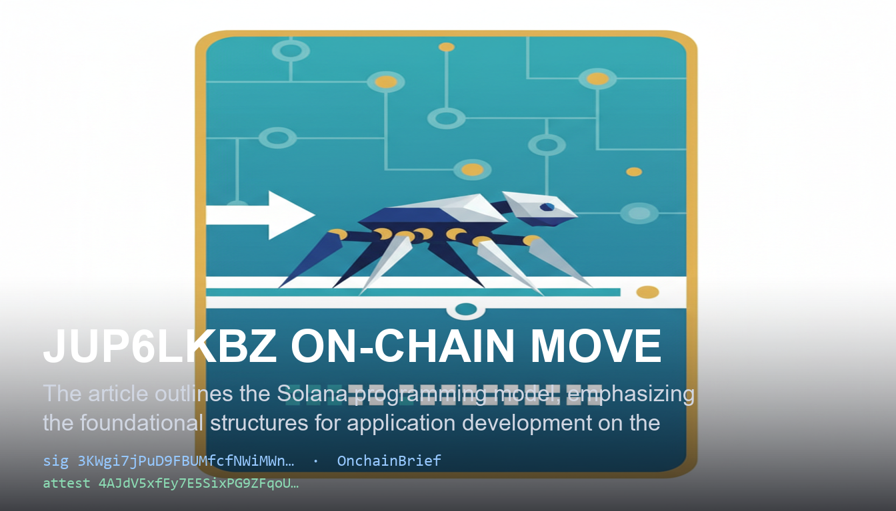

# JUP6LkbZ on-chain move

The article outlines the Solana programming model, emphasizing the foundational structures for application development on the platform. It provides a beginner's guide to building, deploying, and testing Solana programs using the Anchor framework and Solana Playground, along with tools for migrating builtin programs to Core BPF. Additionally, it discusses the upgradability of Solana programs and includes key takeaways from a course on building and deploying a fullstack SPL Token Minter dApp.

## Sources
- https://blog.syndica.io/an-introduction-to-the-solana-programming-model-accounts-data-and-transactions/
- https://solana.com/docs/intro/quick-start/deploying-programs
- https://github.com/solana-program
- https://www.youtube.com/watch?v=T2jPIIsObXw
- https://www.sec3.dev/blog/solana-internals-part-2-how-is-a-solana-program-deployed-and-upgraded

## Provenance
Solana tx `3KWgi7jPuD9FBUMfcfNWiMWn4pbL9LPuMWab9Ko48umCzHChWs9xba2yebwywRYxHwKcWFNPdJGAkHcMiDouZKE8` — https://solscan.io/tx/3KWgi7jPuD9FBUMfcfNWiMWn4pbL9LPuMWab9Ko48umCzHChWs9xba2yebwywRYxHwKcWFNPdJGAkHcMiDouZKE8

Attestation tx `4AJdV5xfEy7E5SixPG9ZFqoULDz1UN9Vbfrup2bJygFZegrvQaJpdc169dUPU46ga3Nq3vEfEiM4Zm8p6zmwv8mj` (devnet) — https://solscan.io/tx/4AJdV5xfEy7E5SixPG9ZFqoULDz1UN9Vbfrup2bJygFZegrvQaJpdc169dUPU46ga3Nq3vEfEiM4Zm8p6zmwv8mj?cluster=devnet
