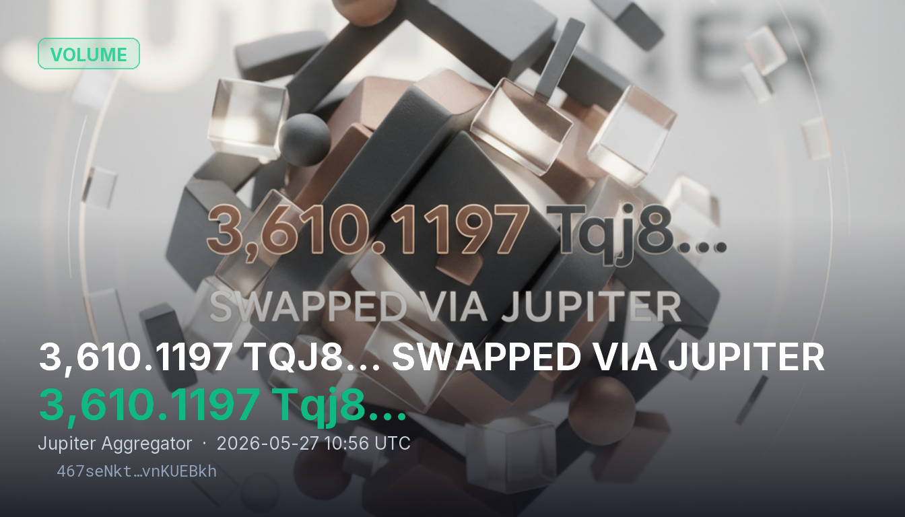

# 3,610.1197 Tqj8… SWAPPED VIA JUPITER

3,610.1197 Tqj8… was swapped from 8sQZ4H4jqnFwUG8e2Y9Sbr3gJxL4cVssc7eQz7M19t7y to 8VSTs2hk2AXhRkRJUahpBaJaDRfJqrFxh4ZtdAAajMRX through Jupiter Aggregator using the SharedAccountsRouteV2 instruction. The trade highlights continued routing flow through Jupiter, which aggregates liquidity across Solana DEX venues to optimize token execution paths.

## Sources
- https://dune.com/ilemi/jupiter-aggregator-solana
- https://nansen.ai/post/what-is-jupiter-exchange
- https://eco.com/support/en/articles/14801182-jupiter-aggregator-how-solana-s-dex-router-works
- https://www.bitstamp.net/en-gb/learn/cryptocurrency-guide/what-is-jupiter-jup/
- https://www.youtube.com/watch?v=tuDbsIipgEY

## Provenance
Solana tx `467seNktDVgScaGN1bym8xduWdEq3mzgyVcefA9HZwjjgbVMizqBWGy69JMTAjWJhTZMUK48A6Skgjy3vnKUEBkh` — https://solscan.io/tx/467seNktDVgScaGN1bym8xduWdEq3mzgyVcefA9HZwjjgbVMizqBWGy69JMTAjWJhTZMUK48A6Skgjy3vnKUEBkh
Category: Volume
