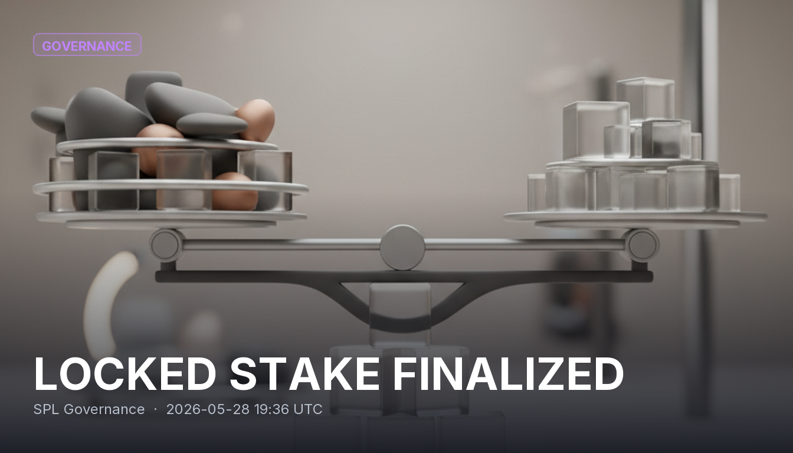

# LOCKED STAKE FINALIZED

A `FinalizeLockedStake` instruction was executed through the SPL Governance program in transaction `4PXfW42xg51VBNoaYuKYb6srjFQfXup4yAgYEEtRWVXJeck5cNML5JcqxNPd9bphNxPXvaiNqDZh19c2J25TnaGK`. SPL Governance is the standard on-chain framework DAOs on Solana use to manage proposals and voting, so an instruction at this level reflects a change to a DAO's governance state rather than ordinary token activity.

## Sources
- https://github.com/solana-labs/solana-program-library/blob/master/governance/README.md
- https://lib.rs/crates/spl-governance
- https://solana.com/developers/dao
- https://www.helius.dev/blog/solana-governance--a-comprehensive-analysis
- https://medium.com/coinmonks/solana-dao-governance-part-1-understanding-spl-governance-3ccf6d6912bc

## Provenance
Solana tx `4PXfW42xg51VBNoaYuKYb6srjFQfXup4yAgYEEtRWVXJeck5cNML5JcqxNPd9bphNxPXvaiNqDZh19c2J25TnaGK` — https://solscan.io/tx/4PXfW42xg51VBNoaYuKYb6srjFQfXup4yAgYEEtRWVXJeck5cNML5JcqxNPd9bphNxPXvaiNqDZh19c2J25TnaGK
Category: Governance
