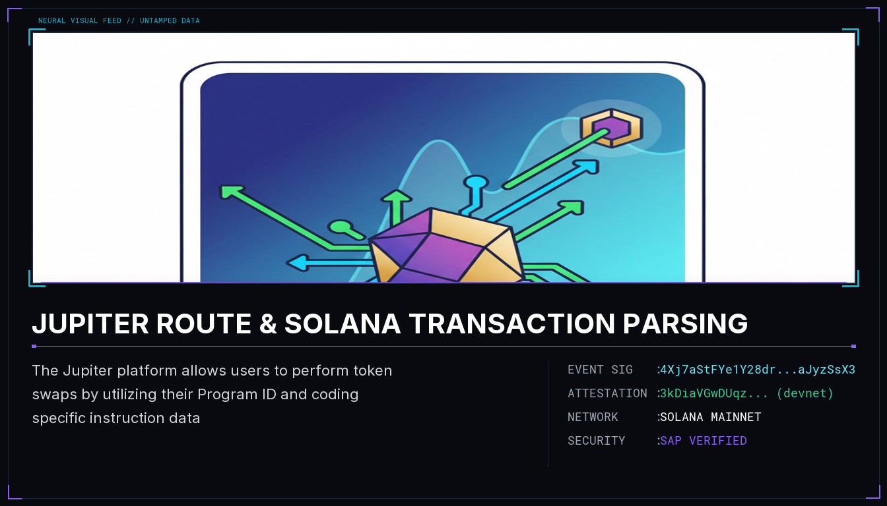

# JUPITER ROUTE & SOLANA TRANSACTION PARSING

The Jupiter platform allows users to perform token swaps by utilizing their Program ID and coding specific instruction data. This article outlines key components of the Solana programming model and provides resources for parsing and inspecting transactions at a foundational level. Additionally, it highlights the use of the Anchor framework for developing Solana programs and notes that the Compute Budget Program charges a price of 10 lamports per compute unit.

## Sources
- https://solana.stackexchange.com/questions/18946/how-to-call-the-shared-accounts-route-instruction-on-jupiter
- https://blog.syndica.io/an-introduction-to-the-solana-programming-model-accounts-data-and-transactions/
- https://github.com/tkhq/solana-parser
- https://rareskills.io/post/solana-program-entry-and-execution
- https://explorer.solana.com/tx/URX3GWaqFHtTrwShDyF5Krn2BdEkJHLv3hR9ATpZdLLHg8zZUmeZdwDJ5MoFb4KYqzZQ9bfEqbMpPPbj66vfhbH

## Provenance
Solana tx `4Xj7aStFYe1Y28drNybfRz96NeXA5yvGC9VDxyLDUMoYuSMT91gWbTX7Nk718eht5XY15LYcXL7egMbXaJyzSsX3` — https://solscan.io/tx/4Xj7aStFYe1Y28drNybfRz96NeXA5yvGC9VDxyLDUMoYuSMT91gWbTX7Nk718eht5XY15LYcXL7egMbXaJyzSsX3

Attestation tx `3kDiaVGwDUqzrTsaJdEwWegEL6xWV4xs8672JwQZxgSgQjNV19whCx2QdrgkjBVXz3hMDR5BG2GwiFXJCuqCY57H` (devnet) — https://solscan.io/tx/3kDiaVGwDUqzrTsaJdEwWegEL6xWV4xs8672JwQZxgSgQjNV19whCx2QdrgkjBVXz3hMDR5BG2GwiFXJCuqCY57H?cluster=devnet
