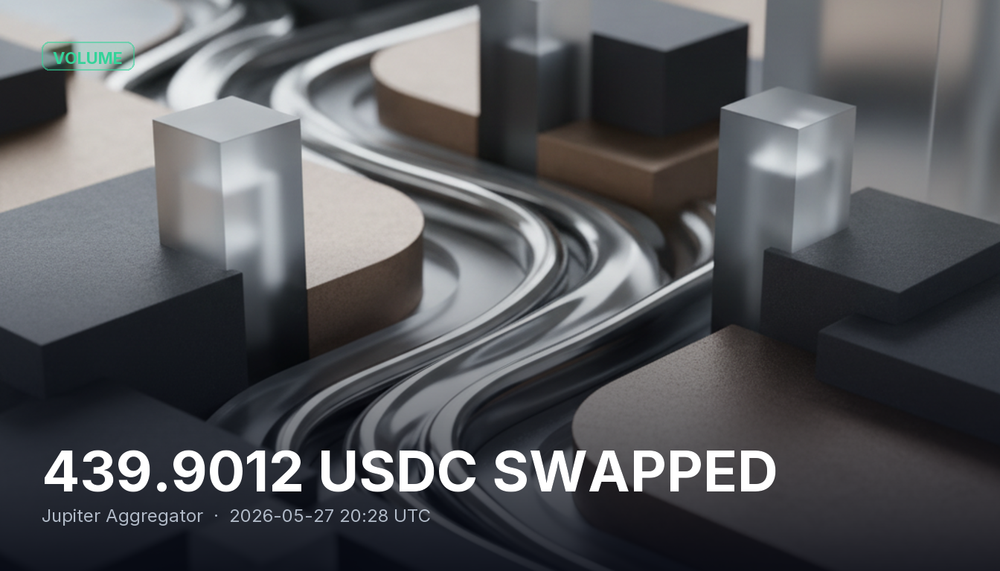

# 439.9012 USDC SWAPPED

A swap transaction of 439.9012 USDC (~$440 USD) was executed from address 8ekCy2jHHUbW2yeNGFWYJT9Hm9FW7SvZcZK66dSZCDiF to GJvewfRjqTUPtx6WsBSUnaFbdgXwgXnWfpDyLm65T4YA using the Jupiter Aggregator. This highlights Jupiter's role as a key player in facilitating seamless and efficient token swaps on the Solana blockchain.

## Sources
- https://learn.backpack.exchange/articles/what-is-jupiter-crypto
- https://jup.ag/
- https://www.youtube.com/watch?v=tuDbsIipgEY
- https://academy.youngplatform.com/en/cryptocurrencies/beyond-simple-dex-what-is-how-works-jupiter/
- https://solanacompass.com/projects/jupiter

## Provenance
Solana tx `4yBAQjaoDGjQ5SSzpGshwWLSGNEWTdNB8DPJPSqEKu4EjRFXopTkgV29YhW9YBejudy1pUX41uucv73RW1NoMMxW` — https://solscan.io/tx/4yBAQjaoDGjQ5SSzpGshwWLSGNEWTdNB8DPJPSqEKu4EjRFXopTkgV29YhW9YBejudy1pUX41uucv73RW1NoMMxW
Category: Volume
