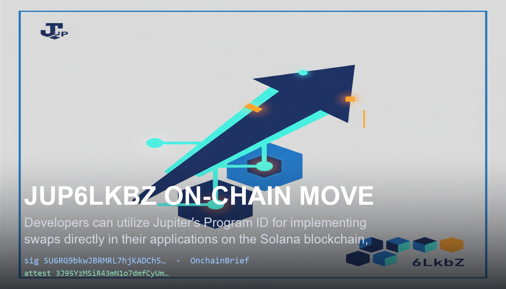

# JUP6LkbZ on-chain move

Developers can utilize Jupiter's Program ID for implementing swaps directly in their applications on the Solana blockchain, integrating with its comprehensive programming model. A library is available that provides tools for parsing and inspecting Solana transactions, enhancing the development process. This tutorial series also emphasizes building Solana programs using the Anchor framework, which facilitates coding in native Solana instructions.

## Sources
- https://solana.stackexchange.com/questions/18946/how-to-call-the-shared-accounts-route-instruction-on-jupiter
- https://blog.syndica.io/an-introduction-to-the-solana-programming-model-accounts-data-and-transactions/
- https://github.com/tkhq/solana-parser
- https://rareskills.io/post/solana-program-entry-and-execution
- https://explorer.solana.com/tx/URX3GWaqFHtTrwShDyF5Krn2BdEkJHLv3hR9ATpZdLLHg8zZUmeZdwDJ5MoFb4KYqzZQ9bfEqbMpPPbj66vfhbH

## Provenance
Solana tx `5U6RG9bkwJBRMRL7hjKADCh5Xz65DQrd9BhTH9jM1iBcZtxophaYYJDkuV3Z3ow5H92efZPEpaavDB8JJWradivt` — https://solscan.io/tx/5U6RG9bkwJBRMRL7hjKADCh5Xz65DQrd9BhTH9jM1iBcZtxophaYYJDkuV3Z3ow5H92efZPEpaavDB8JJWradivt

Attestation tx `3J95YzMSiR43mN1o7dmfCyUmBPbjfeWxHRJPG7wxPa8uTZJtZZ5WyYdPqipGf9tikkT1w99NAigDzDsQAFFgtnVw` (devnet) — https://solscan.io/tx/3J95YzMSiR43mN1o7dmfCyUmBPbjfeWxHRJPG7wxPa8uTZJtZZ5WyYdPqipGf9tikkT1w99NAigDzDsQAFFgtnVw?cluster=devnet
