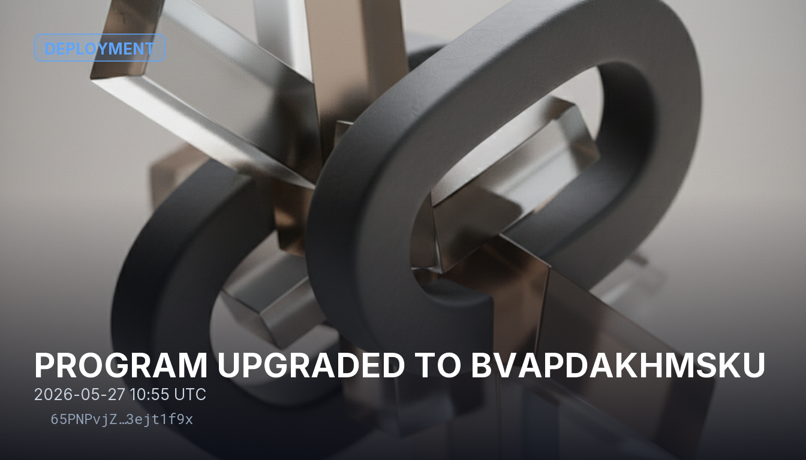

# PROGRAM UPGRADED TO BvAPdAKHMsku

The program `BvAPdAKHMsku` was upgraded through the BPF upgradeable loader. An upgrade replaces the program's on-chain code under its existing address, so anything that relied on the previous behavior should be re-checked against the new version.

## Sources
- https://solscan.io/account/BvAPdAKHMskuT3sVxkgrvsboNHRnbf2rXexrMh2E3RKi
- https://solscan.io/account/94JNQxXp6q95kW6p5uobgRzMdLqQztpy89CPFS89EZWC
- https://solana.com/docs/core/programs/program-deployment

## Provenance
Solana tx `65PNPvjZgGRwPFneFnZZpjoLmqhRyw1qPPvPgBjuvzZMXmDTzmk3BKqFhZXGxe4KuFbf84ogBwLpiR5F3ejt1f9x` — https://solscan.io/tx/65PNPvjZgGRwPFneFnZZpjoLmqhRyw1qPPvPgBjuvzZMXmDTzmk3BKqFhZXGxe4KuFbf84ogBwLpiR5F3ejt1f9x
Category: Deployment
